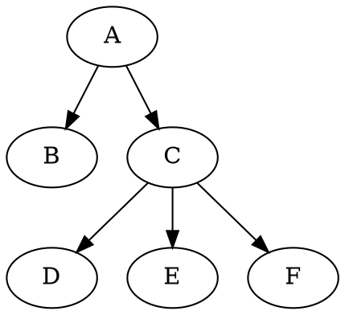

# GoBang-AI

## 博弈树模型与极大极小值搜索

由于五子棋是一个完全信息下的零和博弈，只有一方胜利、一方失败，所以该问题可以使用博弈树来刻画，如下图：

@import "\\figures\\gameTree.png"

假设我们拥有一个对于当前局面的评估函数Q-Function，那么博弈树叶子的权值就是这个局面的Q-Value，博弈树的内部节点的权值这样决定：奇数层的权值是其子结点中最大的，偶数层的权值是其子结点中最小的。

这意味着：甲总是试图使得Q尽可能大，乙总是设图使得Q尽可能小。

因此我们可以采用DFS来遍历这棵博弈树，当然由于整棵树可能非常大，所以我们需要限定树高，问题得到解决。

## $\alpha\text{-}\beta$剪支

假设每一步可能的走法有$N$种，那么前$M$层就有$O(N^M)$的节点总数。这个数量级是非常巨大的，所以剪支是十分必要的，这里我们采用的最为重要的剪支策略是$\alpha\text{-}\beta$剪支。

算法的基本思想是：玩家不会作出对自己不利的选择。

我们已知，对奕使得局面在MAX层走向值最大的子结点，在MIN层走向值最小的子结点。

如下图：A位于MIN层（A还有父亲，这里没有画出），BC位于MAX层，DEF位于MIN层。

不妨设我们现在位于MAX层的C节点（已经访问过B等节点），假设$\alpha$表示迄今找到的最大的$Value$，即我们目前最好的结果（我们希望$\alpha$越大越好，所以这是我们的最低要求），$\beta$表示我们对手目前最好的结果（对手希望$\beta$越小越好，所以这是对手的最低要求）。

那么搜索C的子结点D，得到$Value$，如果$Value > \alpha$, $\alpha ← Value$。如果$Value \geq \beta$，不再访问E，F，直接返回$\beta$。

为什么这样呢？如果$Value \geq \beta$，意味着这种情况超出的对手的忍耐极限，他不会允许出现这种情况，所以他根本不会选择$A→C$这条路！所以我们也就不需要继续访问C的其他子结点了。

至于MIN层的决策，因为是对偶的，所以是相同的道理。

## 其他优化
除了对于搜索树的剪支，还有一些其他的优化策略。
### 搜索空间的压缩
因为五子棋的特性，我们一般是不会下在一个不与任何棋子相邻（即其相邻的8个位置都没有棋子）的位置的，所以我们每一步的拓展只会发生在现有棋子周围，这样大大地压缩了搜索空间。
### 启发式搜索
同样因为五子棋的特性，我们一般下在对手刚落子的周围，可能是最优的选择，所以我们对搜索顺序作出优化，优先搜索上一步落子的周围，加上$\alpha\text{-}\beta$剪支，实际的效果是非常优秀的，因为许多“很差”的选择被剪支掉了。

## 估值函数

最后来说明一下对于局面的估值函数$Q$的选择。

这里参考了许多网上的教程，比较常用的是对连子进行简单的加权求和。

我采用的权重表格如下：

| 连子 | 权重|
|--- | ---|
|活1 | 10 |
| 活2 | 100 |
| 活3 | 1000 |
| 活4 | 10000 |
| 五子 | $\infty$ |
| 死1 | 1 |
| 死2 | 10 |
| 死3 | 100 |
| 死4 | 1000 |

在计算$Q$的时候，我对$15\times 15$的棋盘处理成行、列、正斜线、反斜线的4张表格，然后直接在每个表格的每一行进行统计连子即可。

整个$Q$的计算时间复杂度为$O(M)$，其中$M$表示棋盘大小$15×15$。
